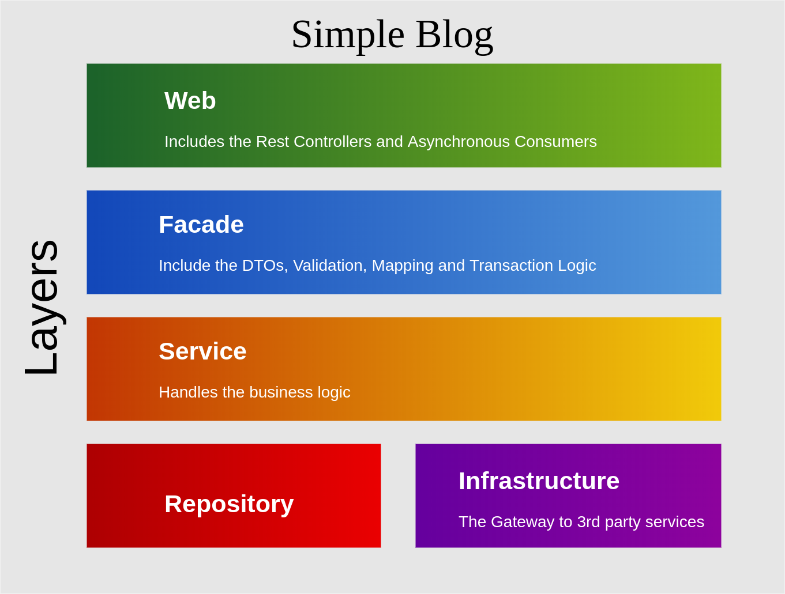

# simple-blog

This is a simple blog created using Spring Boot 2, JDK 11, that uses Postgres SQL

## Structure
The project is designed based on a multi layer architecture like in the following image 

### Development
The Exposed API can be viewed here: http://localhost:8180/swagger-ui.html